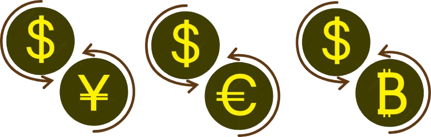
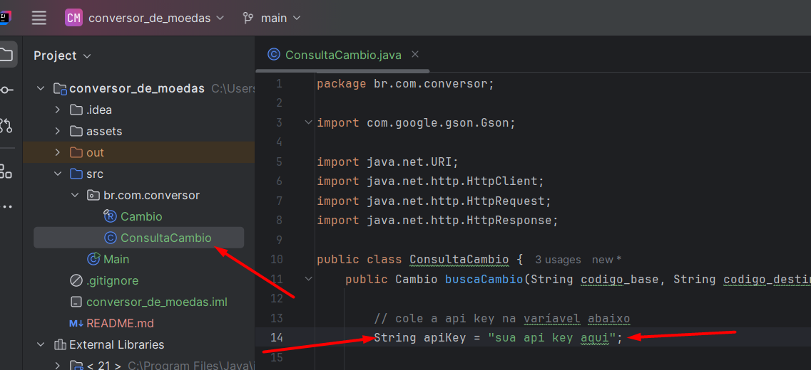

# Conversor de Moedas

## Descrição

Este projeto é um desafio proposto pela Alura e a Oracle na formação java Alura + Oracle Next Education.

O objetivo seria criar um conversor de moedas dinâmico, ou seja, que buscasse as informações de moedas atuais, de acordo com o mercado, e fizesse a conversão de moedas com 6 opções.

Para resolver o desafio foi utilizada a api [ExchangeRate-API](https://www.exchangerate-api.com/), que fornece a solução de converter e buscar informações sobre as moedas, em tempo real, de acordo com o mercado financeiro.

## Tecnologias

- Java Kit Development 21.04
- API externa
- Git (gerenciamento de versão)
- Github (repositório online do projeto)
- Biblioteca Gson (2.11.0)

## Pré-requisitos

- Java 21.04
- Ter a chave da api [ExchangeRate-API](https://www.exchangerate-api.com/)

## Instalação
- Baixar o código fonte como zip ou através de comando no GIT
- Instalar a biblioteca Gson (2.11.0) como dependência
- Informar a chave da api na varíavel `apiKey` na classe `ConsultaCambio`

## Execução
- Utilizar IntelliJ IDEA
- Executar o método `main` da class `Main` em `src`

## Como usar

Ao executar a função serão apresentadas 6 opções de conversão de moedas, basta selecionar a opção dedsejada e dar enter;

Depois o sistema vai perguntar o valor para converter, basta informar que o sistema vai fazer a conversão e mostrar o valor na moeda base e o valor na moeda destino, já convertido.

## Autor
Wevesson Madson

